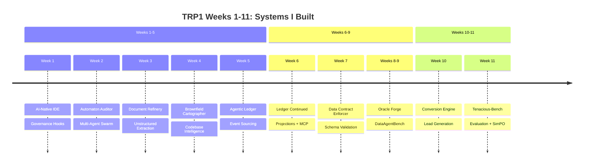
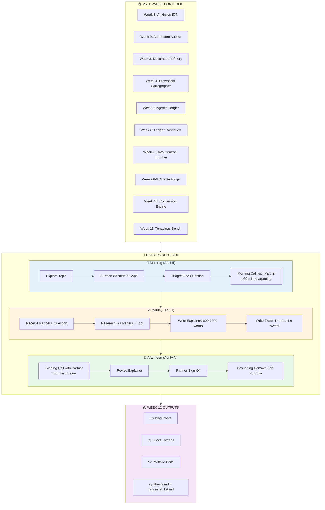
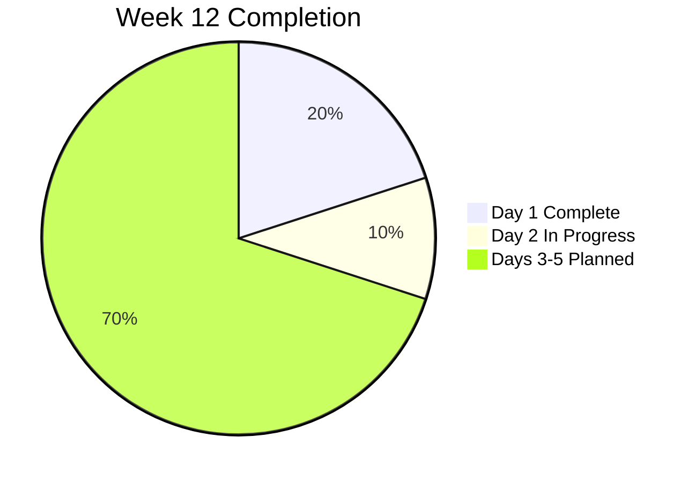

# 🧠 Knowledge Gap Forge

<div align="center">


**Daily Paired Gap Research, Public Explainers, and Portfolio Depth**

*"The FDE does not memorize systems. The FDE builds instruments that make systems legible — including their own understanding."*

</div>

---

## 📋 Overview

Week 12 is the capstone of the TRP1 Forward-Deployed Engineer program. After **11 weeks of shipping production-grade systems**, this week is about **understanding**.

I am not building new systems. I am auditing the **11 systems I already built**, finding the places where my understanding is shallow, and closing those gaps through **paired daily research**.

**By end of Week 12, I will have:**
- ✅ Closed **10 knowledge gaps** (5 I named, 5 I researched for others)
- ✅ Published **5 blog posts** and **5 tweet threads** under my identity
- ✅ Made **5 concrete edits** to my portfolio (Weeks 1-11)
- ✅ Built a **personal canonical reading list** of papers, tools, and patterns

---

## 🏗️ The Complete 11-Week Portfolio (What I'm Auditing)



---

## 📚 My Complete Portfolio Artifacts (Weeks 1-11)

Every question I ask this week must connect to a **specific line** in one of these files.

### Weeks 1-5: Core Systems

| Week | Project | Key Artifacts | What It Does |
|------|---------|---------------|--------------|
| **1** | AI-Native IDE | `.orchestration/active_intents.yaml`, `agent_trace.jsonl`, `intent_map.md`, `CLAUDE.md` | Intent-driven code generation with governance hooks |
| **2** | Automaton Auditor | `src/state.py`, `src/nodes/detectives.py`, `src/nodes/judges.py`, `src/nodes/justice.py` | Multi-agent LangGraph swarm for code audit |
| **3** | Document Refinery | `src/agents/triage.py`, `src/strategies/`, `.refinery/extraction_ledger.jsonl`, `PageIndex` | Document extraction with multi-strategy routing |
| **4** | Brownfield Cartographer | `.cartography/CODEBASE.md`, `lineage_graph.json`, `src/agents/surveyor.py`, `src/agents/hydrologist.py` | Codebase intelligence with lineage graphs |
| **5** | Agentic Ledger | `src/core/event_store.py`, `src/aggregates/`, `src/projections/daemon.py`, `src/mcp/server.py` | PostgreSQL event sourcing with optimistic concurrency |

### Weeks 6-9: Integration & Data Systems

| Week | Project | Key Artifacts | What It Does |
|------|---------|---------------|--------------|
| **6** | Ledger (cont.) | Upcaster registry, cryptographic audit chain, Gas Town pattern | Schema evolution, tamper detection, agent memory |
| **7** | Data Contract Enforcer | `contracts/generator.py`, `contracts/runner.py`, `generated_contracts/`, `violation_log/` | Auto-generated contracts, lineage attribution |
| **8-9** | Oracle Forge | `agent/benchmark_context.py`, `kb/architecture/`, `benchmark_service.py`, `run_agent.py` | DataAgentBench competitor, multi-database agent |

### Weeks 10-11: Tenacious Client Work

| Week | Project | Key Artifacts | What It Does |
|------|---------|---------------|--------------|
| **10** | Conversion Engine | `trace_log.jsonl`, `probe_library.md`, `agent/enrichment/`, `agent/mechanisms/` | Lead generation + qualification for Tenacious |
| **11** | Tenacious-Bench | `scoring_evaluator.py`, `training/run_simpo.py`, `contamination_check.py`, `ablations/run_ablations.py` | Evaluation benchmark + SimPO judge |

---

## 🗺️ The 5-Day Topic Spine

Each day's topic is drawn from my **actual Week 1-11 work**. The cohort votes each evening; these are the gaps I have prepared to ask about.

```mermaid
gantt
    title Week 12 Knowledge Gap Schedule
    dateFormat HH:mm
    axisFormat %H:%M
    
    section Day 1
    LoRA Mechanics (Week 11)     :done, d1, 08:00, 8h
    section Day 2
    LLM-as-Judge Biases (Weeks 2+11) :active, d2, 08:00, 8h
    section Day 3
    Bootstrap CIs (Week 11)      :d3, 08:00, 8h
    section Day 4
    SimPO vs DPO (Week 11)       :d4, 08:00, 8h
    section Day 5
    Contamination Limits (Weeks 7+11) :d5, 08:00, 8h
```



---

## 🎯 The 5 Questions I Am Asking (Gaps in My Understanding)

### Day 1: LoRA Mechanics (Week 11)
> *"In my Week 11 training script (`training/run_simpo.py` lines 45-55), I set LoRA rank=16 and alpha=32. I understand lower rank means fewer parameters, but I cannot explain what the rank actually represents in the weight update matrix. What is the mathematical relationship between LoRA rank and the model's capacity to learn new patterns?"*

**Grounded in:** Week 11 `training/run_simpo.py`

### Day 2: LLM-as-Judge Biases (Weeks 2 + 11)
> *"My Week 11 `scoring_evaluator.py` (lines 280-320) uses an LLM judge for tone_alignment. My Week 2 Automaton Auditor also used LLM judges (Prosecutor/Defense/Tech Lead). When I run the same output through different models, I get different scores. What measurable biases exist in LLM-as-judge systems (position, length, self-preference), and how can I detect them?"*

**Grounded in:** Week 2 `src/nodes/judges.py` + Week 11 `scoring_evaluator.py`

### Day 3: Bootstrap Confidence Intervals (Week 11)
> *"My Week 11 ablation results (`ablations/run_ablations.py` lines 150-180) show Delta A = +16.4 with 95% CI [12.1, 20.7] and p=0.003 using paired bootstrap. I can run the code, but I cannot explain what the bootstrap distribution actually represents. Why is paired bootstrap appropriate for my held-out tasks?"*

**Grounded in:** Week 11 `ablations/run_ablations.py`

### Day 4: SimPO vs DPO (Week 11)
> *"I chose SimPO for my Week 11 judge training because the paper said it's 'reference-free' and cheaper. But I cannot explain the actual gradient difference between DPO and SimPO. What does SimPO optimize that DPO does not? Under what conditions would DPO outperform SimPO?"*

**Grounded in:** Week 11 `methodology_rationale.md` + `training/run_simpo.py`

### Day 5: Contamination Detection Limits (Weeks 7 + 11)
> *"My Week 11 `contamination_check.py` implements n-gram (8-gram), embedding similarity (0.85 threshold), and time-shift verification. My Week 7 Data Contract Enforcer also dealt with data quality. I understand these catch exact duplication, but I cannot explain what contamination they MISS. What is a realistic contamination scenario that would pass all three checks?"*

**Grounded in:** Week 7 `contracts/runner.py` + Week 11 `contamination_check.py`

---

## 🔄 The Daily Paired Research Loop



---

## 📁 Repository Structure

```
knowledge-gap-forge/
├── pair_DAY_1/                    # Day 1: LoRA Mechanics ✅
│   ├── question.md
│   ├── morning_call_summary.md
│   ├── explainer.md
│   ├── thread.md
│   ├── evening_call_summary.md
│   ├── signoff.md
│   ├── grounding_commit.md
│   └── sources.md
├── pair_DAY_2/                    # Day 2: LLM-as-Judge Biases (in progress)
├── pair_DAY_3/                    # Day 3: Bootstrap CIs
├── pair_DAY_4/                    # Day 4: SimPO vs DPO
├── pair_DAY_5/                    # Day 5: Contamination Limits
├── portfolio_updates/             # Actual edits to Weeks 1-11 work
│   ├── week11_model_card_lora.diff
│   ├── week11_scoring_evaluator_bias.diff
│   ├── week11_ablation_bootstrap_comment.diff
│   ├── week11_methodology_simpo.diff
│   └── week11_contamination_4th_check.diff
├── synthesis.md                   # 1500-word week synthesis (final)
├── canonical_list.md              # Annotated reading list (final)
├── portfolio_update.md            # 1-page improvement summary (final)
└── README.md                      # This file
```

---

## 📊 The 5 Blog Posts I Will Write

| Day | Topic | Week Grounding | Blog Title | Key Mechanism |
|-----|-------|----------------|------------|---------------|
| 1 | LoRA Mechanics | Week 11 | "LoRA Rank: What That Number Actually Does" | ΔW = BA, rank = bottleneck dimension |
| 2 | LLM-as-Judge Biases | Weeks 2 + 11 | "Your Evaluator Has Hidden Biases" | Position bias, length bias, self-preference |
| 3 | Bootstrap CIs | Week 11 | "What 95% Confidence Actually Means" | Paired bootstrap resampling distribution |
| 4 | SimPO vs DPO | Week 11 | "Reference-Free Preference Optimization" | SimPO eliminates reference model |
| 5 | Contamination Limits | Weeks 7 + 11 | "What Your Contamination Checks Miss" | Semantic drift, structural pattern leakage |

---

## 🎯 The Four Properties of a Great Question

Every question I ask is scored by peers and tutors on these criteria:

| Property | Definition | My Day 1 Score |
|----------|------------|----------------|
| **Diagnostic** | Names a specific gap whose closure changes how I do FDE work | ✅ 5/5 |
| **Grounded** | Connects to a specific artifact I shipped (from any week) | ✅ 5/5 |
| **Generalizable** | Helps many FDEs, not just me | ✅ 4/5 |
| **Resolvable** | Colleague can write 600-1000 word explainer | ✅ 5/5 |

---

## 📈 Progress Tracker



| Day | Topic | Week | Question | Explainer | Sign-off | Grounding |
|-----|-------|------|----------|-----------|----------|-----------|
| 1 | LoRA Mechanics | 11 | ✅ | ✅ | ✅ | ✅ |
| 2 | LLM-as-Judge Biases | 2+11 | 🔄 | 🔄 | ⏳ | ⏳ |
| 3 | Bootstrap CIs | 11 | ⏳ | ⏳ | ⏳ | ⏳ |
| 4 | SimPO vs DPO | 11 | ⏳ | ⏳ | ⏳ | ⏳ |
| 5 | Contamination Limits | 7+11 | ⏳ | ⏳ | ⏳ | ⏳ |

---

## 📚 Canonical Reading List (To Be Built)

By end of Week 12, I will have contributed an annotated list of the most valuable papers and tools for FDEs, drawn from my 11-week journey:

| Category | Paper/Tool | Week Used | Why It Matters |
|----------|------------|-----------|----------------|
| **PEFT** | LoRA (Hu et al., ICLR 2022) | Week 11 | Foundation of efficient fine-tuning |
| **PEFT** | Intrinsic Dimensionality (Aghajanyan et al., ACL 2021) | Week 11 | Explains why LoRA works |
| **Evaluation** | LLM-as-a-Judge Survey (Gu et al., 2025) | Weeks 2, 11 | Catalog of biases |
| **Evaluation** | Preference Leakage (Li et al., 2025) | Week 11 | Cross-family judging requirement |
| **Statistics** | Bootstrap Methods (Efron, 1979) | Week 11 | Confidence intervals for benchmarks |
| **Optimization** | SimPO (Meng et al., NeurIPS 2024) | Week 11 | Reference-free preference optimization |
| **Data** | Contamination Survey (Chen et al., EMNLP 2025) | Week 11 | Limits of n-gram detection |
| **Agents** | LangGraph Documentation | Weeks 2, 4, 8-9 | Stateful multi-agent orchestration |
| **Event Sourcing** | Event Sourcing (Greg Young) | Weeks 5-6 | Immutable audit trails |
| **Data Contracts** | Bitol Open Data Contract Standard | Week 7 | Schema validation at scale |
| **Tool** | PEFT Library (HuggingFace) | Week 11 | LoRA implementation |
| **Tool** | Unsloth | Week 11 | Fast LoRA training |
| **Tool** | tree-sitter | Week 4 | Multi-language AST parsing |
| **Tool** | sqlglot | Week 4 | SQL lineage extraction |

---

## 🧪 How to Verify My Work

```bash
# Clone the repository
git clone https://github.com/TsegayIS122123/knowledge-gap-forge.git
cd knowledge-gap-forge

# Check Day 1 deliverables
cat pair_DAY_1/question.md
cat pair_DAY_1/explainer.md
cat pair_DAY_1/grounding_commit.md

# View the diff of portfolio edits (Weeks 1-11)
ls portfolio_updates/

# Read the week synthesis (after Saturday)
cat synthesis.md
```

---

## 🙏 Acknowledgments

- **Program:** Tenacious Recruitment Program (TRP1) - FDE Track
- **Institution:** 10 Academy
- **Client:** Tenacious Intelligence Corp
- **Instructors:** Program staff who designed this 11-week journey
- **Peers:** My daily partners who sharpen my questions
- **Papers cited:** All authors whose work I build upon

---

## 📧 Contact

**Author:** Tsegay IS122123
**GitHub:** [@TsegayIS122123](https://github.com/TsegayIS122123)

**Portfolio Repositories:**
- [Week 1: AI-Native IDE](https://github.com/TsegayIS122123/Roo-Code)
- [Week 2: Automaton Auditor](https://github.com/TsegayIS122123/automaton-auditor)
- [Week 3: Document Refinery](https://github.com/TsegayIS122123/document-intelligence-refinery)
- [Week 4: Brownfield Cartographer](https://github.com/TsegayIS122123/brownfield-cartographer)
- [Week 5-6: Agentic Ledger](https://github.com/TsegayIS122123/agentic-ledger)
- [Week 7: Data Contract Enforcer](https://github.com/TsegayIS122123/data-contract-enforcer)
- [Weeks 8-9: Oracle Forge](https://github.com/TsegayIS122123/oracle-forge-data-agent)
- [Week 10: Conversion Engine](https://github.com/TsegayIS122123/tenacious-conversion-engine)
- [Week 11: Tenacious-Bench](https://github.com/TsegayIS122123/tenacious-bench-2026)
- [Week 12: Knowledge Gap Forge](https://github.com/TsegayIS122123/knowledge-gap-forge)

---

<div align="center">
  <sub>Built with 🔥 for the TRP1 FDE Program</sub>
  <br>
  <sub>"Find the gap. Sharpen the question. Teach what you just learned. Edit what you already shipped."</sub>
  <br>
  <br>
  <sub>11 Weeks of Building → 1 Week of Understanding → A Lifetime of FDE Excellence</sub>
</div>
