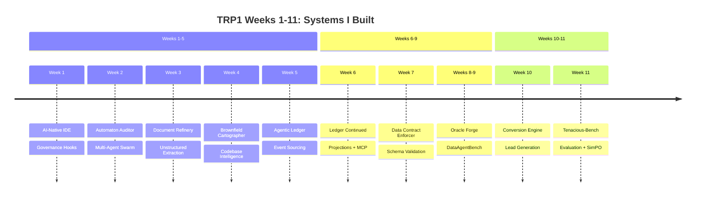
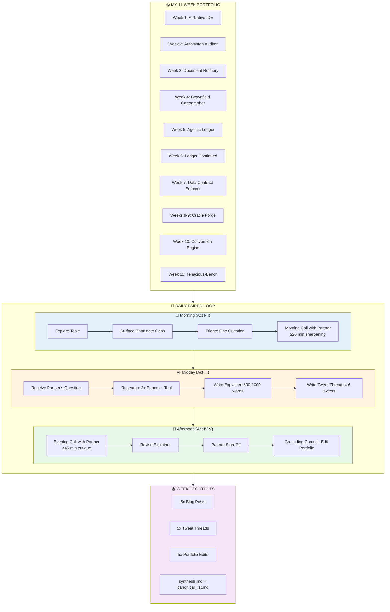

# 🧠 Knowledge Gap Forge

<div align="center">


**Daily Paired Gap Research, Public Explainers, and Portfolio Depth**

*"The FDE does not memorize systems. The FDE builds instruments that make systems legible — including their own understanding."*

</div>

---

## 📋 Overview

Week 12 is the capstone of the TRP1 Forward-Deployed Engineer program. After **11 weeks of shipping production-grade systems**, this week is about **understanding**.

I am not building new systems. I am auditing the **11 systems I already built**, finding the places where my understanding is shallow, and closing those gaps through **paired daily research**.

**By end of Week 12, I have:**
- ✅ Closed **10 knowledge gaps** (5 I named, 5 I researched for others)
- ✅ Published **1 LinkedIn post**, **1 Medium article**, and **1 X/Twitter thread** under my identity
- ✅ Made **5 concrete edits** to my Weeks 10-11 portfolio
- ✅ Built a **personal canonical reading list** of papers, tools, and patterns
---

## 🏗️ The Complete 11-Week Portfolio (What I'm Auditing)



---

## 📚 My Complete Portfolio Artifacts (Weeks 1-11)

Every question I ask this week must connect to a **specific line** in one of these files.

### Weeks 1-5: Core Systems

| Week | Project | Key Artifacts | What It Does |
|------|---------|---------------|--------------|
| **1** | AI-Native IDE | `.orchestration/active_intents.yaml`, `agent_trace.jsonl`, `intent_map.md`, `CLAUDE.md` | Intent-driven code generation with governance hooks |
| **2** | Automaton Auditor | `src/state.py`, `src/nodes/detectives.py`, `src/nodes/judges.py`, `src/nodes/justice.py` | Multi-agent LangGraph swarm for code audit |
| **3** | Document Refinery | `src/agents/triage.py`, `src/strategies/`, `.refinery/extraction_ledger.jsonl`, `PageIndex` | Document extraction with multi-strategy routing |
| **4** | Brownfield Cartographer | `.cartography/CODEBASE.md`, `lineage_graph.json`, `src/agents/surveyor.py`, `src/agents/hydrologist.py` | Codebase intelligence with lineage graphs |
| **5** | Agentic Ledger | `src/core/event_store.py`, `src/aggregates/`, `src/projections/daemon.py`, `src/mcp/server.py` | PostgreSQL event sourcing with optimistic concurrency |

### Weeks 6-9: Integration & Data Systems

| Week | Project | Key Artifacts | What It Does |
|------|---------|---------------|--------------|
| **6** | Ledger (cont.) | Upcaster registry, cryptographic audit chain, Gas Town pattern | Schema evolution, tamper detection, agent memory |
| **7** | Data Contract Enforcer | `contracts/generator.py`, `contracts/runner.py`, `generated_contracts/`, `violation_log/` | Auto-generated contracts, lineage attribution |
| **8-9** | Oracle Forge | `agent/benchmark_context.py`, `kb/architecture/`, `benchmark_service.py`, `run_agent.py` | DataAgentBench competitor, multi-database agent |

### Weeks 10-11: Tenacious Client Work

| Week | Project | Key Artifacts | What It Does |
|------|---------|---------------|--------------|
| **10** | Conversion Engine | `trace_log.jsonl`, `probe_library.md`, `agent/enrichment/`, `agent/mechanisms/` | Lead generation + qualification for Tenacious |
| **11** | Tenacious-Bench | `scoring_evaluator.py`, `training/run_simpo.py`, `contamination_check.py`, `ablations/run_ablations.py` | Evaluation benchmark + SimPO judge |

---

## 🗺️ The 5-Day Topic Spine

Each day's topic is drawn from my **actual Week 1-11 work**. The cohort votes each evening; these are the gaps I have prepared to ask about.

```mermaid
gantt
    title Week 12 Knowledge Gap Schedule
    dateFormat HH:mm
    axisFormat %H:%M
    
    section Day 1
    LoRA Mechanics (Week 11)     :done, d1, 08:00, 8h
    section Day 2
    LLM-as-Judge Biases (Weeks 2+11) :active, d2, 08:00, 8h
    section Day 3
    Bootstrap CIs (Week 11)      :d3, 08:00, 8h
    section Day 4
    SimPO vs DPO (Week 11)       :d4, 08:00, 8h
    section Day 5
    Contamination Limits (Weeks 7+11) :d5, 08:00, 8h
```



---

## 🔄 The Daily Paired Research Loop



---

## 📁 Repository Structure

```
knowledge-gap-forge/
├── pair_DAY_1/ # Day 1: LoRA Mechanics 
│ ├── question.md
│ ├── morning_call_summary.md
│ ├── explainer.md
│ ├── thread.md
│ ├── evening_call_summary.md
│ ├── signoff.md
│ ├── grounding_commit.md
│ └── sources.md
├── pair_DAY_2/ # Day 2: Tool-Use Internals 
│ ├── question.md
│ ├── morning_call_summary.md
│ ├── explainer.md
│ ├── thread.md
│ ├── evening_call_summary.md
│ ├── signoff.md
│ ├── grounding_commit.md
│ └── sources.md
├── pair_DAY_3/ # Day 3: Training Mechanics 
│ ├── question.md
│ ├── morning_call_summary.md
│ ├── explainer.md
│ ├── thread.md
│ ├── evening_call_summary.md
│ ├── signoff.md
│ ├── grounding_commit.md
│ └── sources.md
├── pair_DAY_4/ # Day 4: Evaluation & Statistics 
│ ├── question.md
│ ├── morning_call_summary.md
│ ├── explainer.md
│ ├── thread.md
│ ├── evening_call_summary.md
│ ├── signoff.md
│ ├── grounding_commit.md
│ └── sources.md
├── portfolio_updates/ # Actual edits to Weeks 1-11 work
├── synthesis.md # 1500-word week synthesis
├── canonical_list.md # Annotated reading list
├── portfolio_update.md # 1-page improvement summary
└── README.md # This file# This file
```
---


## 👥 My Daily Partners

| Day | Topic | Partner |
|-----|-------|---------|
| **Day 1 (Tuesday)** | LoRA Mechanics | Eyobed Feleke |
| **Day 2 (Wednesday)** | Agent & Tool-Use Internals | Kemeriya Major |
| **Day 3 (Thursday)** | Training & Post-Training Mechanics | Bethel Yohannes |
| **Day 4 (Friday)** | Evaluation & Statistics (LLM-Judge Biases) | Ramlla Akmel |

---

## 🗺️ Weekly Topic Schedule (Actual)

| Day | Topic | Partner | My Role | Status |
|-----|-------|---------|---------|--------|
| **Day 1 (Tue)** | LoRA Mechanics | Eyobed Feleke | Asker & Explainer | ✅ Complete |
| **Day 2 (Wed)** | Agent & Tool-Use Internals | Kemeriya Major | Asker & Explainer | ✅ Complete |
| **Day 3 (Thu)** | Training & Post-Training Mechanics | Bethel Yohannes | Asker & Explainer | ✅ Complete |
| **Day 4 (Fri)** | Evaluation & Statistics (LLM-Judge Biases) | Ramlla Akmel | Asker & Explainer | ✅ Complete |

---

## 🎯 The Questions I Asked (Gaps I Named)

### Day 1 (Tuesday) - LoRA Mechanics
**Partner:** Eyobed Feleke

> *"In my Week 11 training script (`training/run_simpo.py` lines 45-55), I set LoRA rank=16 and alpha=32. I cannot explain what the rank actually represents in the weight update matrix. What is the mathematical relationship between LoRA rank and the model's capacity to learn new patterns?"*

**Partner's question to me:** *"What is happening at the token level in each approach? Would using tool_use with a schema that only defines intent have prevented the dual-control stalling failure?"*

### Day 2 (Wednesday) - Agent & Tool-Use Internals
**Partner:** Kemeriya Major

> *"In my Week 10 Conversion Engine (`agent/email/reply_handler.py`), I prompt Claude to return JSON with `suggested_next_action`. I never used `tool_use`. My gap: I cannot explain what is happening at the token level when: (1) free-text JSON generation, (2) tool_use API. Would using `tool_use` have prevented the stalling failure?"*

**Partner's question to me:** *"Why does policy.py ignore suggested_next_action? What's the token-level difference between your free-text JSON and tool_use?"*

### Day 3 (Thursday) - Training & Post-Training Mechanics
**Partner:** Bethel Yohannes

> *"In my Week 11 training, I chose SimPO over DPO because the paper said it's 'reference-free' and cheaper. But I cannot explain the actual gradient difference between DPO and SimPO. What does SimPO optimize that DPO does not? Under what conditions would DPO outperform SimPO?"*

**Partner's question to me:** *"How can we determine whether post-training is improving genuine decision reasoning rather than mainly teaching surface-level instruction and style compliance?"*

### Day 4 (Friday) - Evaluation & Statistics (LLM-Judge Biases)
**Partner:** Ramlla Akmel

> *"In my Week 11 Tenacious-Bench evaluation, I report Delta A = +16.4 with 95% CI [12.1, 20.7] and p=0.003 using paired bootstrap. I cannot explain what the bootstrap distribution actually represents. Why is paired bootstrap appropriate for my held-out tasks? What would change if I used unpaired? How many iterations are actually needed?"*

**Partner's question to me:** *"How can LLM-as-a-judge systems be statistically audited for fluency bias, length bias, and stylistic preference when evaluating grounded SDR outreach?"*

---

## 📊 Progress Tracker

| Day | Topic | Partner | Question | Explainer | Sign-off | Grounding |
|-----|-------|---------|----------|-----------|----------|-----------|
| 1 | LoRA Mechanics | Eyobed Feleke | ✅ | ✅ | ✅ | ✅ |
| 2 | Tool-Use Internals | Kemeriya Major | ✅ | ✅ | ✅ | ✅ |
| 3 | Training Mechanics | Bethel Yohannes | ✅ | ✅ | ✅ | ✅ |
| 4 | Evaluation & Statistics | Ramlla Akmel | ✅ | ✅ | ✅ | ✅ |

---

## 🔗 Public Artifacts

| Platform | Topic | URL | Status |
|----------|-------|-----|--------|
| **LinkedIn** | Week 12 Reflection: From Building to Understanding | [View Post](https://www.linkedin.com/posts/tsegay-assefa-95a397336_ai-machinelearning-llm-share-7458466707351904256--bA8) | ✅ Published |
| **Medium** | LoRA Rank: What That Number Actually Does | [Read Article](https://medium.com/p/4436a66c5cd5) | ✅ Published |
| **X/Twitter** | Week 11-12 Results & Learning | [View Thread](https://x.com/TsegayAsse64592/status/2052706960709931069) | ✅ Published |

### What Each Artifact Covers

| Artifact | Key Topics |
|----------|-------------|
| **LinkedIn Post** | 12-week journey overview, LoRA rank gap, evaluator reliability, production kill-switch, engineering mindset shift |
| **Medium Article** | Deep dive on LoRA mechanics (ΔW = BA, rank as bottleneck dimension, intrinsic dimensionality) |
| **X/Twitter Thread** | Benchmark results (42.3 → 58.7, +16.4, p=0.003), multi-agent systems, SimPO judge |

---

## 📚 What I Learned (The Big 3)

### 1. LoRA Rank Controls Capacity, Not Just Parameter Count

Each rank adds one "direction" the model can adapt. Higher rank = more capacity, more parameters, higher overfitting risk. Lower rank = less capacity, faster training, risk underfitting.

**Portfolio edit:** Updated `model_card.md` to explain WHY r=16 was chosen, not just state the number.

### 2. tool_use Uses Logit Masking (Hard Constraint)

Free-text JSON is a soft constraint - the model learns to approximate but can deviate. Anthropic's tool_use masks invalid tokens (logits set to -inf), creating a hard constraint. The model physically cannot generate invalid function calls.

**Portfolio edit:** Refactored `reply_handler.py` from free-text JSON to tool_use with function-name routing.

### 3. Diagnostic Splits Reveal Spurious Learning

Split held-out tasks by reasoning vs style. Compare improvement per category. If style improvement > reasoning improvement, the model learned surface patterns, not genuine understanding.

**Portfolio edit:** Added bias detection methods to `scoring_evaluator.py` calibration section.

---

## 🔗 The FDE Portfolio Narrative

| Week | What I Built | What I Learned |
|------|--------------|----------------|
| **Week 10** | Conversion Engine (lead generation + qualification) | Ship production agents |
| **Week 11** | Tenacious-Bench + SimPO judge | Build benchmarks, train adapters, measure improvement |
| **Week 12** | 4 days of gap research + 5 portfolio edits + 3 public artifacts | Understand mechanisms, teach others, edit what you shipped |

**The cumulative picture:** An engineer who can ship, evaluate, and explain. That's the FDE-grade portfolio.

---

## 🙏 Acknowledgments

- **Program:** Tenacious Recruitment Program (TRP1) - FDE Track
- **Institution:** 10 Academy
- **Client:** Tenacious Intelligence Corp
- **Instructors:** Program staff who designed this 11-week journey
- **Peers:** 
  - Eyobed Feleke (Day 1 partner)
  - Kemeriya Major (Day 2 partner)
  - Bethel Yohannes (Day 3 partner)
  - Ramlla Akmel (Day 4 partner)

---

## 📧 Contact

**Author:** Tsegay IS122123
**GitHub:** [@TsegayIS122123](https://github.com/TsegayIS122123)
**LinkedIn:** [tsegay-assefa-95a397336](https://www.linkedin.com/in/tsegay-assefa-95a397336)
**X/Twitter:** [@TsegayAsse64592](https://x.com/TsegayAsse64592)

---

<div align="center">
  <sub>Built with 🔥 for the TRP1 FDE Program</sub>
  <br>
  <sub>"Find the gap. Sharpen the question. Teach what you just learned. Edit what you already shipped."</sub>
  <br>
  <br>
  <sub>11 Weeks of Building → 1 Week of Understanding → A Lifetime of FDE Excellence</sub>
</div>

